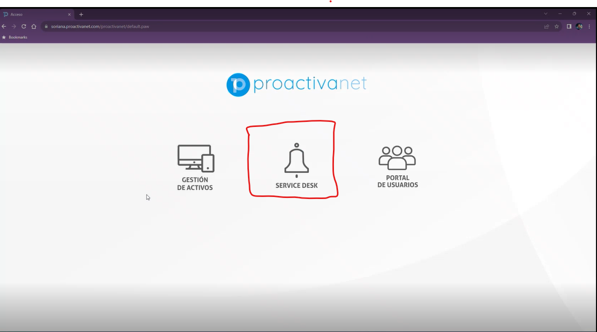
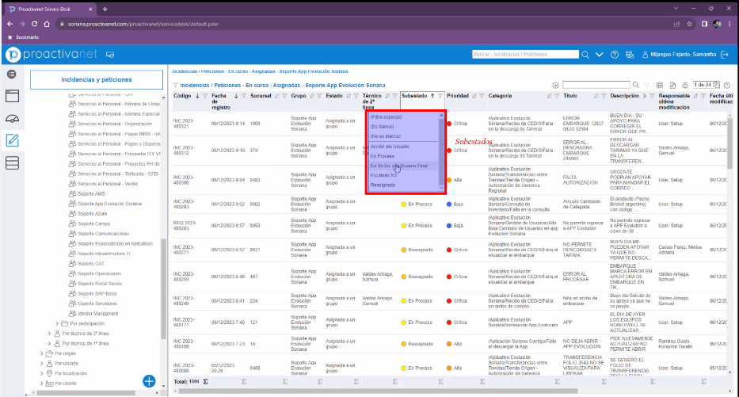
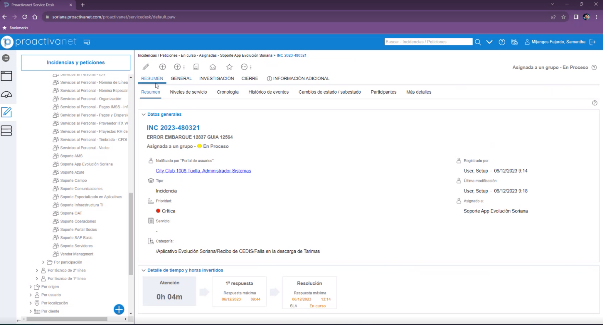
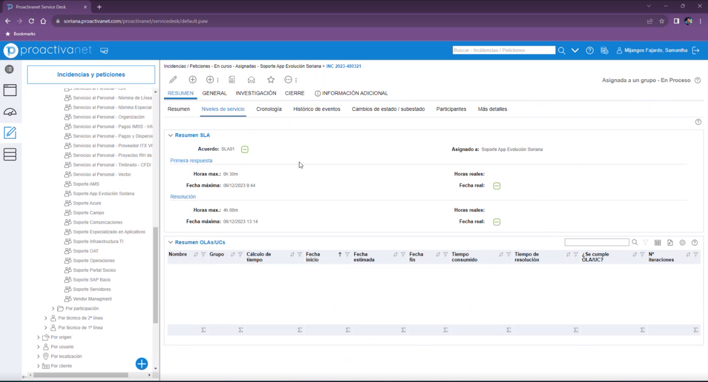
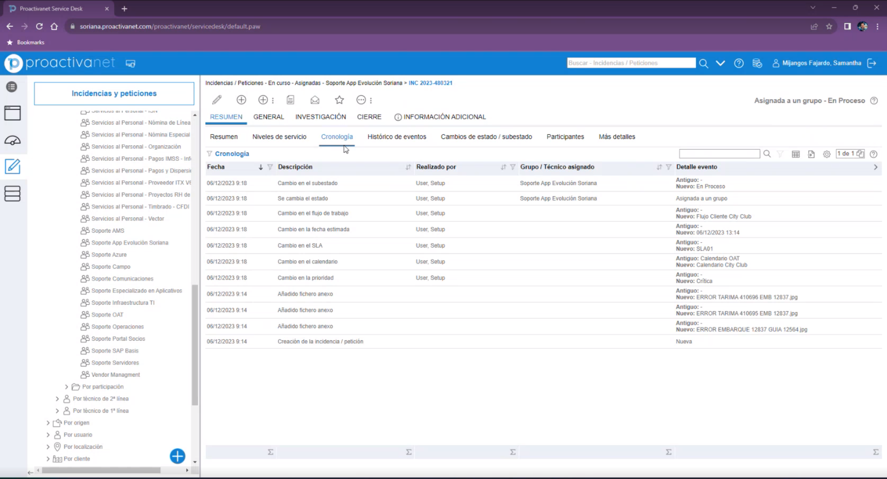
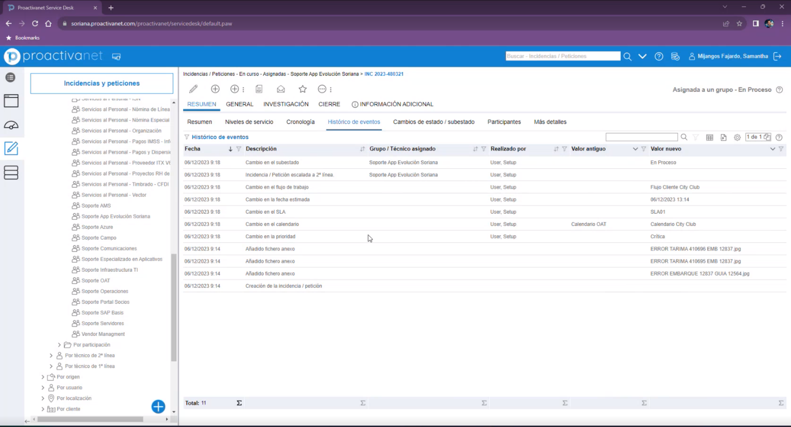

# Documentacion general de la plataforma PROACTIVANET

La patalla principal del portal y donde vamos a atender los tickets es la de **SERVICE DESH**.
Es una platafomra administrada por Inetum y un provedor interno

Esta es la pantalla que se muestra al entrar al **SERVICE DESH**

Es este apartado estan los diferentes grupos

En ***Mis incidencias / peticiones*** se podra ver lo que temenos asignado y ahi se podra ver todo lo asignado y en que estatus se encuentran.

Regularmente o normalmente la forma en que se trabaja es en el apartado de ***Incidencias / peticiones en curso***.
Ahi se encuenta la primera rama, la que nos interesa actualmente es la de ***Por grupo y tecnico***, ***Por asingacion***, ***Por grupo de 2 linea*** y ***Por asignacion***. Ahi ya se encuentran todos los grupos de trabajo donde se encuentran con los que vamos a trabajar que son lo sigientes. 

A este grupo se le asignan los grupos y cada grupo se encarga de asignarlo a un ingeniero

Ejemplo **App Evolution Soriana**

Aqui se encuentra la lista de tickets, se puede filtrar por lo que se quiera con los filtros que se tienen en la parte superior. Por lo que se suele giear mas es por la ***Cartegoria*** ya que la categoria si se hace una tabla dinamica de la extraccion en la categoria se puede ver cual es el top.
Como se guian en los demas grupos es por el top de categoria es como se van solucionando los tickets y se observa cual es la categoria que esta creciendo mas y ver si hay por ejemplo una incidencia masiva.

Es importante identificar como hacer la extraccion, hacer una agrupacion correcta, ver los conteos, saber cuales son los que estan pendientes y cuales estan en visto bueno.

Es este apartado los subestados funcionan como otro de los filtor para saber en que estatus se encuentra internamente en ticket. Por ejemplo 
- *Vo.Bu por Usuario:* es que nosotros ya lo mandamos a validar y ya se encuentra atendido pero falta el ultimo check por parte del usuario para que lo valide y se de por cerrado el ticket.
- *Accion de Usuario:* es cuando solicitamos informaciona al usuario y nos tienen que compartir la informacon faltante, imagenes, usuario o algun otro dato.
- *En Proceso:* Lo que esta pendiende de procesar o fue asignado por primera ves
- *Reasignado:* Lo que ya fue atendido y aun falta algo por solucionar, la solucion proporcionada no cubior el problema por completo y el usuario no lo acepto.

Ejemplo de cuando **Seleccionas un Tickert** 

*Resumen:* Aqui se podra ver quien lo reporto, la tienda, fecha, estatus, etc.

*Nivel de servicio:* Este esta asosiado a la categoria, lo define la categoria.

*Cronologia:* Aqui se puede ver cuando se creo, quien cambio el estado, cuando se asigno.

*Historico de eventos:* Similar a la cronologia pero aqui viene el apartado para ver los cambios que hubo entre valor.

*Cambios de estato/ subestado:* Similar a la cronologia pero aqui viene el apartado para ver los cambios que hubo entre valor.

*Participantes:* Similar a la cronologia pero aqui viene el apartado para ver los cambios que hubo entre valor.

*Mas detalles:* Similar a la cronologia pero aqui viene el apartado para ver los cambios que hubo entre valor.

